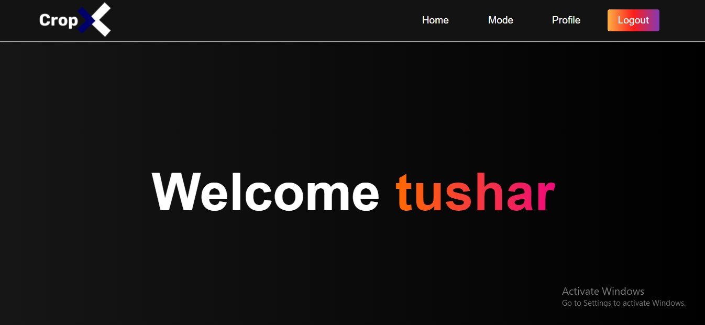
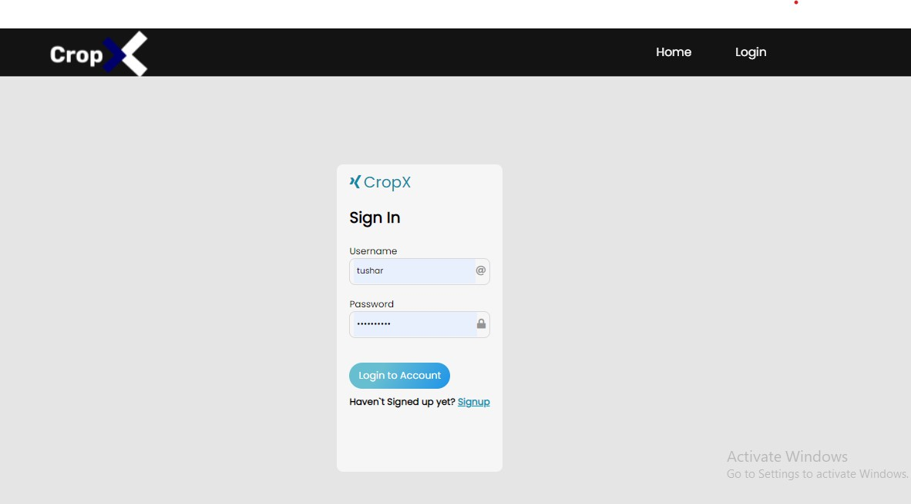
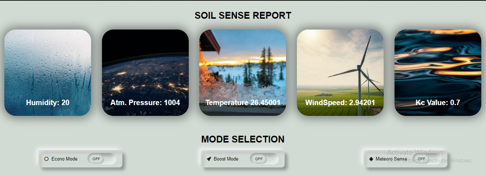

# CropX
Django Web Application for Smart Irrigation Management System using Artificial Intelligence.

## Description
CropX is a Smart Irrigation Management System that uses AI to Conserve  water usage by crops and also Optimize their growth with Minimal and Automatic irrigation.
CropX is built with **Django 3.2** as backend, **HTML** and **CSS** for frontend and **Firebase** as a Database.
CropX also uses NodeMcu to collect data and export them to Firebase using various sensors such as DHT and Soil Moisture Sensor.





## Getting Started
### Dependencies
Python >= 3.9

Django >= 4.0.3

Pandas 

Numpy

pyrebase (wrapper for Firebase API`s)

Preferred OS- Windows 10/Any linux distribution/Mac

## Setup

The first thing to do is to clone the repository:

```sh
$ git clone https://github.com/tushaverma643/CropX.git
$ cd CropX
```
Then install the dependencies:

```sh
pip install -r requirements.txt
```
Note that you may use Virtual enviornment as well by using -  `(env)` in front of the prompt. This indicates that this terminal
session operates in a virtual environment.

Once `pip` has finished downloading the dependencies:
```sh
cd CropX 
python manage.py runserver
```
And navigate to `http://127.0.0.1:8000`.
Thats it.

## Author
**Tushar Verma**  - Full stack Development 

Django, HTML/CSS, Firebase.

[@tusharverma](https://www.linkedin.com/in/tusharverma643/)

## Version History
* 0.1
    * Initial Release

## License

This project is licensed under the MIT License - see the LICENSE.md file for details


